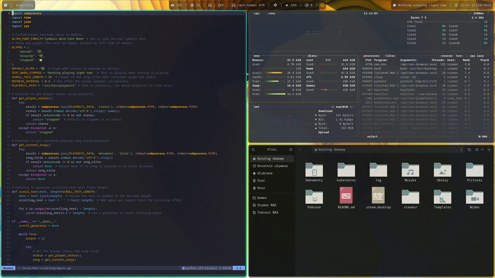

## Content
Some of my system's configuration
Apps:
- Hyprland
- Waybar
- Alacricitty
- NVIM

Scripts:
- scrolling-mpris - Custom waybar module written in Python. It basically print part of the title obtained from playerctl trimmed to Nth char, after short period of time it prints part of the title with 1 char offset simulating scrolling effect (GIF below)
- sinks-picker - ~~Stolen~~ Forked script. Its querying pipewire for output devices, displays them with rofi and allows to change audio output. I've added ability to query virtual devices (like headphones with 7.1 filter)
- power-menu-rofi - Very simple power menu, logout function may need to be changed depending on WM/Compositor, support hyprland out of the box. 
- random-wallpaper - Simple scripts that shuffles through wallpaper folder (defaults to `$HOME/Pictures/Wallpapers`) and on random, sets wallpaper every X seconds (this period needs to be passed as first argument while calling script, look at my hyprland.conf for example). This script also allows for reloading wallpaper by sending SIGUSR1 to it's process (Again, look at my hyprland.conf, keybindings section, reloading wallpaper is binded to MOD+A) 

Other: 
- My .zshrc
- List of explicitly installed pacman packages 

## Screenshots

Custom MPRIS module with scrolling effect

