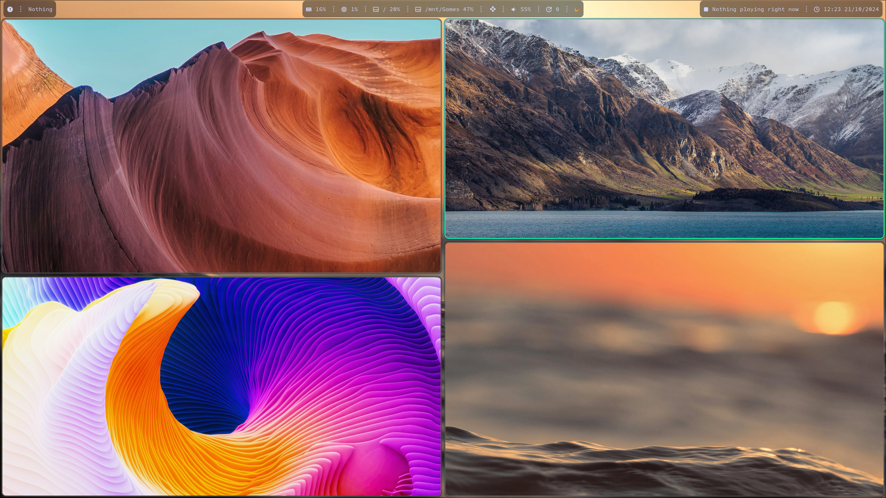

## Content
Some of my system's configuration
Apps:
- Hyprland
- Waybar
- Alacricitty
- NVIM
- Rofi

### Rofi
Rofi themes are based on w8ste's Tokyonight color scheme.
sinks-picker and power-menu are using their own style extension which are located next to `tokyonight.rasi`. `tokyonight.rasi` is (and will be) used as base configuration which will allow to keep rofi-based tools looks consistent. 

### Scripts:
- scrolling-mpris - Custom waybar module written in Python. It basically print part of the title obtained from playerctl trimmed to Nth char, after short period of time it prints part of the title with 1 char offset simulating scrolling effect (GIF below)
- sinks-picker - Customly written Python script. It's querying `wpctl status` to extract output devices resulting in nice rofi-based menu for choosing default audio device.
- power-menu-rofi - Very simple power menu, logout function may need to be changed depending on WM/Compositor, support hyprland out of the box. 
- random-wallpaper - Simple scripts that shuffles through wallpaper folder (defaults to `$HOME/Pictures/Wallpapers`) and on random, sets wallpaper every X seconds (this period needs to be passed as first argument while calling script, look at my hyprland.conf for example). This script also allows for reloading wallpaper by sending SIGUSR1 to it's process (Again, look at my hyprland.conf, keybindings section, reloading wallpaper is binded to MOD+A) 

Other: 
- My .zshrc
- List of explicitly installed pacman packages 

## Screenshots

#### Wallpaper showcase

#### Custom power menu

#### Rofi app picker style

#### Rofi sinks picker

#### Custom MPRIS module with scrolling effect

